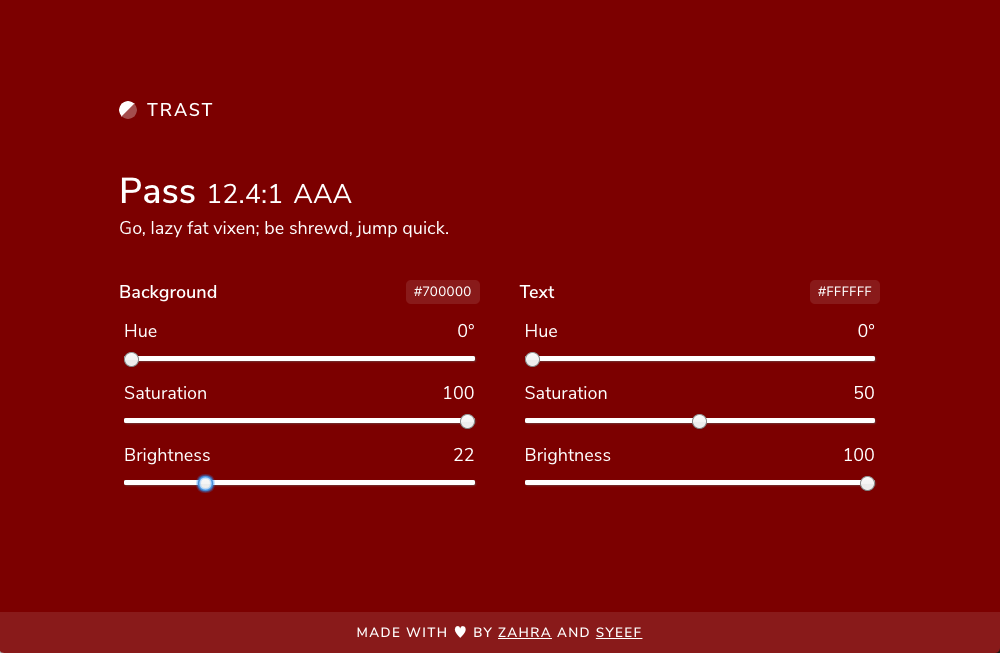

# Trast
An interactive playground for picking color combinations 🎨

### Running in development
* Clone the repo: `git clone https://github.com/ZahraTee/trast.git`
* Open the directory: `cd trast`
* Install dependencies: `npm install` or `yarn install`
* Run the app: `npm run start` or `yarn start`

### Contributing
We want Trast to be as useful as possible and welcome suggestions for improvements - feel free to open an issue or open a pull request!